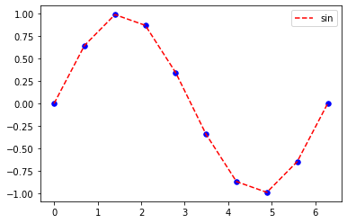
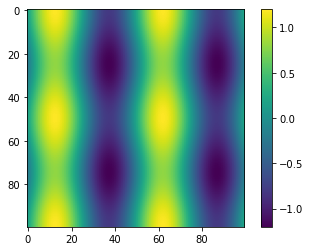

# Pythonの基礎

---

[実践計算物理学 ―物理を理解するためのPython活用法―](https://www.kyoritsu-pub.co.jp/book/b10025215.html)

より抜粋して説明します。

書籍内のコードが一部公開されておりますので参照下さい。

 - 1_Pythonプログラミングへの準備

[](https://colab.research.google.com/github/comp-phys-kyoritsu/codes/blob/main/1_Python%E3%83%95%E3%82%9A%E3%83%AD%E3%82%AF%E3%82%99%E3%83%A9%E3%83%9F%E3%83%B3%E3%82%AF%E3%82%99%E3%81%B8%E3%81%AE%E6%BA%96%E5%82%99.ipynb)

 - 2_Pythonの基礎 - 基本的なルール

[](https://colab.research.google.com/github/comp-phys-kyoritsu/codes/blob/main/2_Python%E3%81%AE%E5%9F%BA%E7%A4%8E%20-%20%E5%9F%BA%E6%9C%AC%E7%9A%84%E3%81%AA%E3%83%AB%E3%83%BC%E3%83%AB.ipynb)

 - 3_Pythonの基礎 - ライブラリ

[](https://colab.research.google.com/github/comp-phys-kyoritsu/codes/blob/main/3_Python%E3%81%AE%E5%9F%BA%E7%A4%8E%20-%20%E3%83%A9%E3%82%A4%E3%83%95%E3%82%99%E3%83%A9%E3%83%AA.ipynb)

---

## インデント

 - Pythonではインデントの揃った部分が1つのブロックとみなされる。
 - 異なるブロックはキーワード+コロン:で始まる。


```python
print("Hello world")
    print("Hello world")
```


      File "<ipython-input-3-08b837f97b05>", line 2
        print("Hello world")
        ^
    IndentationError: unexpected indent
    

---

```python
# シャープ(#)以下の文章は無視される(コメントアウト)
# コードの説明や補足, 不要な文を無効化したいときなどに用いる
for i in range(10):
    # rangeは連番を取得する関数. この例では0,1,...,9を取得し,
    # 順番にiに代入することで繰り返し処理をする.
    x = i + 1
    print(x)
```

    1
    2
    3
    4
    5
    6
    7
    8
    9
    10
    

---

## データ型

 - Pythonで取り扱うことができるデータは、数値、真偽値、文字列の3種類
 


```python
x = 12   # xを整数(int)型変数として定義.
         # 12.あるいは12.0とすると浮動小数点(float)型,
         # 12+0jとすると複素数(complex)型となる(jは虚数単位).
         # 数値型はint, float, complexの3種類.
y = True # yを真偽値(bool)型変数として定義.
         # bool型はint型のサブクラスでTrue=1, False=0と同じ.
z = "PC" # zを文字列(str)型変数として定義.
         # " "や’ ’で囲うとstr型として認識される
```

---

## データ型：複合的な型

 - Pythonのデータ型には、上記の基本的なデータ型を要素とする複合的なデータ型（コンテナ型）が存在する。
 - リスト、タプル、集合、辞書など 


---

### リスト


```python
x = [1, 2, 3]
y = ["Hello", " ", "world"]
```


```python
x + y             # リストの結合→ [1,2,3,"Hello"," ","world"]
len(x)            # リストの長さの取得→ 3
2 in x            # リストに要素が含まれるか→ True
x[0] = "A"        # xの0番目の要素を"A"に書き換える
x.append("X")     # xの最後に"X"を追加
for a in x:       # リストの要素で繰り返し処理をする
    print("a=", a)  # → a=A, a=2, a=3, a=Xと連続して出力される
```

    a= A
    a= 2
    a= 3
    a= X
    

---

### 辞書


```python
d = {"h":6.626e-34, "c":0} # {"key1":value1, · · · }のように書く
print(d["h"])              # Key="h"のValueの取得
d["c"] = 2.998e+8          # Key="c"のValueを変更
d["e"] = 1.602e-19         # {"e":1.602e-19}の要素を追加
for key, value in d.items():
    # itemsメソッドはkeyとvalueの組を取得. 反復処理に用いられる
    print(key, value)
```

---

## 関数:def


```python
def user_sum(x, y):
    ans = x+y
    return ans
```

```python
user_sum(2, 3) # → 5
ans = user_sum(1, 7) # ansに8を代入
```


 - 引数の型を指定しないため、関数を引数にすることもできる。

```python
def ope(func, vals):
    return func(vals[0], vals[1])
ope(user_sum, [3,4])
```


    7

---

 - デフォルト値を設定することができる


```python
def func(x, y=1, z=2):
    return z * (x + y)
ans = func(3, 4, 5)     # ansに5*(3+4)を代入
ans = func(3)           # ansに2*(3+1)を代入
ans = func(3, z=-1)     # ansに-(3+1)を代入
ans = func(3, z=1, y=2) # ansに1*(3+2)を代入. 順番は変更可
ans = func(3, y=2, 1)   # エラー
# 一度引数を指定したら, その後の引数はすべて指定しなければならない
```


      File "<ipython-input-7-a58389f95d0f>", line 7
        ans = func(3, y=2, 1)   # エラー
                          ^
    SyntaxError: positional argument follows keyword argument
    


---

## 関数：lambda

 - 1行のみの関数を定義したい場合はlambda式を用いる方法がある。


```python
func = lambda x, y=1, z=2: z*(x+y)
```


```python
print(func(10))
print(func(10,1,1))
```

    22
    11
    

---

## 条件分岐と繰り返し処理

 - 条件分岐のif文、繰り返し処理のfor文は以下のとおり


```python
for i in range(10):
    if i % 2 == 0: # if 条件式:の形で用いる. Trueなら以下を実行
        print(i, "even number")
    else:          # Falseなら以下を実行. elif文で複数分岐も可能
        print(i, "odd number")
```

    0 even number
    1 odd number
    2 even number
    3 odd number
    4 even number
    5 odd number
    6 even number
    7 odd number
    8 even number
    9 odd number
    

---

## リスト内包表記

 - for文、if文を用いたリスト作成方法と以下のような表記が用いられる。
 - このような書き方はリスト内包表記と呼ばれる。


```python
a = [i for i in range(3)]              # リスト[0,1,2]を作成
a = [i**2 for i in range(5) if i%2==0] # if文と組み合わせも可能
```

---

## ファイル操作
 - ファイルの開き方
```python
f = open("filename","w") # 書き込み用に開く
f = open("filename","r") # 読み込み用に開く
f = open("filename","a") # 追記用に開く.
```
 - ファイルへの書き込み
```python
f = open("test.txt","w")
f.write("Hello World\n") # 文字列を書き込む. \nは改行を表す
f.write("Hello {0}, {1}\n".format("Tokyo","Japan"))
f.close() # openしたファイルは最後にcloseで閉じる必要がある
```
---

 - 読み込み
```python
with open("test.txt") as f:  # open関数のデフォルトは"r"
    for line in f:           # 1行ずつ読み込む
        print(line.rstrip()) # rstrip()で文字列の右端を削除
```
    Hello World
    Hello Tokyo, Japan

---

## クラスの基礎

 - クラスは奥が深いので詳しく理解する必要は無いが、以下の構文程度は感覚的に知っておいたほうが良い。


```python
class Person:                 # Personというクラスを定義
    def __init__(self, name): # インスタンス化の際に実行される
        self.name = name
    def __repr__(self):       # print文での出力結果を指定
        return "Name : "+str(self.name)+", Age : "+str(self.age)
    def set_age(self, age):   # age変数を設定するメソッド
        self.age = age
```


```python
TP = Person("PhysicsTarou")   # クラスのインスタンス化.
TP.set_age(30)                # メソッドの呼び出し
print(TP)                     # __repr__で指定された出力をする
print(TP.name, TP.age)        # メンバ変数を直接呼び出す
```

    Name : PhysicsTarou, Age : 30
    PhysicsTarou 30
    

---

## ライブラリの基礎

 - Pythonは、数多くのライブラリ（パッケージと呼ぶ）が公開されいる。この膨大なパッケージの存在が、Pythonが多くのユーザーに利用される理由である。
 - Pythonを使う上でパッケージの利用は必要不可欠である。
 - パッケージの呼び出し方法は次のとおりとなっている。


```python
import numpy       # numpyパッケージを読み込む
import numpy as np # numpyパッケージをnpという名前で読み込む
from numpy import random
    # numpyパッケージの中のrandomモジュールを読み込む
import numpy.random
    # 同じモジュールをnumpy.randomという名前で読み込む
from numpy import * # numpyパッケージの全モジュールを読み込む
```

---

### numpy

 - 数値計算を効率的に行なうための必須ライブラリ
 - 下に示すnumpy用の配列（ndarrayと呼ばれる）はベクトル、行列などの多次元配列を示すことができ、数値計算では必要不可欠


```python
import numpy as np
a = np.array([1, 2, 3])
```

 - ndarrayの操作

```python
a = np.array([1, 2, 2, 4])
b = np.array([5, 6, 7, 8])
c = a[:3] # 0-2番目の要素を取り出す(スライス)
          # スライスには様々な使い方がある
          # a[1:3], a[::2], a[-1], a[::-1]なども確認してみよう
d = np.append(a, b)     # 2つの配列の結合
e = a.reshape(2, 2)     # 配列の形状を任意に変換
f = e.flatten()         # 多次元配列を1次元配列に変換
g = d.shape             # ndarrayの形状をタプルで取得 
```

---

 - ndarrayの演算

```python
m = 2.0*a              # 全ての要素に係数をかける.  
n = a*b                # 要素ごとの積
o = a**3               # 各要素のべき乗  
p = np.dot(a,b)        # ベクトルの内積
q = a + 1j*b           # 要素ごとの和. 複素数のndarrayに対して, 
  # np.conj(q)=a-1j*b, np.real(q)=a, np.imag(q)=bなどとなる
r = a[:,None] + b[None,:]
  # s_ij = a_i + b_jを要素とする2次元配列を所得する
s = 2 + a 
  # スカラー量との加減算は2 => 2*np.ones(a.shape)と解釈される
```

---

### matplotlib

 - Python用の可視化ツール
 - 詳細は[公式](https://matplotlib.org/)を参照

```python
import matplotlib.pyplot as plt
import numpy as np
x = np.linspace(0, 2*np.pi, 10)
y = np.sin(x)             # プロットしたい1次元配列を準備
plt.plot(x, y, color="red", linestyle="dashed", label="sin")
  # x, y座標のデータの他、色やスタイル、凡例の指定ができる
plt.scatter(x, y, s=30, c="blue")
  # 散布図プロットにはscatterを用いる
plt.legend()              # 凡例の表示
plt.show()                # 描画
```



---

```python
a = np.linspace(0, 4*np.pi, 100)
x, y = np.meshgrid(a, a)       # 2次元メッシュの生成
z = np.sin(x) + 0.2*np.cos(y)  # プロットしたい配列の準備
plt.imshow(z)
plt.colorbar()                 # カラーバーを表示
plt.show()
```



